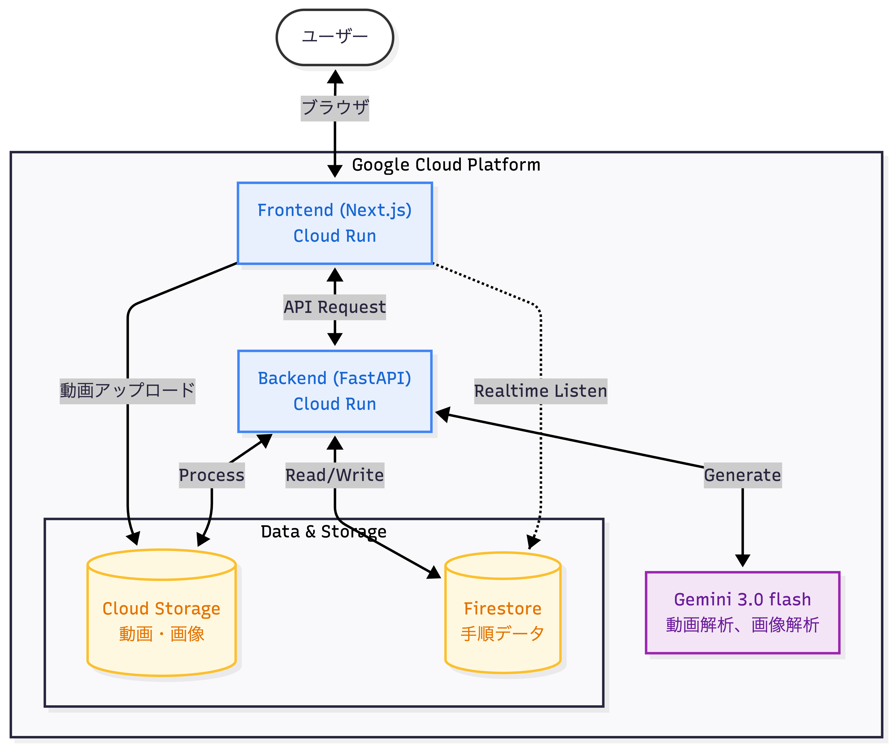

# 【撮るだけマニュアル】  画面収録データからマニュアルを自動生成！

## 背景
「マニュアル作成、面倒ですよね？」

マニュアル作成の課題感に対する統計データを入れる。
例: 
- https://www.siteengine.co.jp/blog/manual_survey/
- https://www.ap-com.co.jp/pressrelease/post-11168/
- https://prtimes.jp/main/html/rd/p/000000073.000010274.html

社会課題へと結びつける。
- IT人材不足
- DXへの遅れ

## 課題
### 課題1: マニュアル作成に時間がかかる
- 手順が多い
- 画面キャプチャを撮って、説明文を書いて、画像編集して、アップロードして、という一連の作業が面倒
- ITリテラシーが高くない人向けの場合、詳細まで丁寧に解説

### 課題2: マニュアルが間違っている
- SaaSの画面変更が早い
- ユーザーからのフィードバックが反映されにくい

### ユーザーストーリー: 「ひとり情シス vs 変化に弱い現場」
ターゲットを明確にする。

## 解決策
### 1. 録画データから手順書を自動生成
動画をアップロードして待つだけ

#### なぜ録画データからなのか
ブラウザDOMベースだと、アプリに対応してない。特に大手企業は独自のレガシーアプリが多く存在する。

### 2. 利用者からのコメント機能
フィードバックの反映

## デモ

youtube動画を添付するだけ

## システムアーキテクチャ
### 概要

### 動画アップロードから手順書生成までの流れ

## 実装のポイント
### BackgroundTasksを活用した非同期処理 & Firestoreによるリアルタイム進捗
*   **内容:** 動画解析は時間がかかるため、ユーザーを待たせないようにバックグラウンドで処理しつつ、Firestoreの `onSnapshot` で進捗をリアルタイムにフロントエンドに反映させている点。
*   **アピール:** 「UXを損なわないための非同期アーキテクチャ」として紹介できます。

### Gemini 3 Flash を活用した2段階解析 (動画解析 → 画像解析)
*   **内容:** いきなり全てを解析するのではなく、まず動画全体から「手順の区切り（タイムスタンプ）」を洗い出し、その後に必要なフレームだけを画像として切り出して詳細解析（説明文生成・マスキング・ハイライト）を行うフロー。
*   **アピール:** LLMのコンテキストウィンドウやコスト、精度を意識したパイプライン設計として映えます。

### 動画の直接アップロード
メモリ効率をアピール

### 画像解析の並列化
*   **内容:** 切り出した複数の画像フレームを並列にGeminiに投げている点
*   **アピール:** 処理時間を短縮するための工夫。

### フロント表示のUX向上
*   **内容:** 以前の作業で実装した「レスポンシブなハイライト枠の太さ調整」や「Canvas (Konva) を使った画像編集UI」など。
*   **アピール:** AI任せにせず、人間が微調整しやすいUIを提供している点は「実用性」のアピールになります。

### CI/CD

## まとめ
