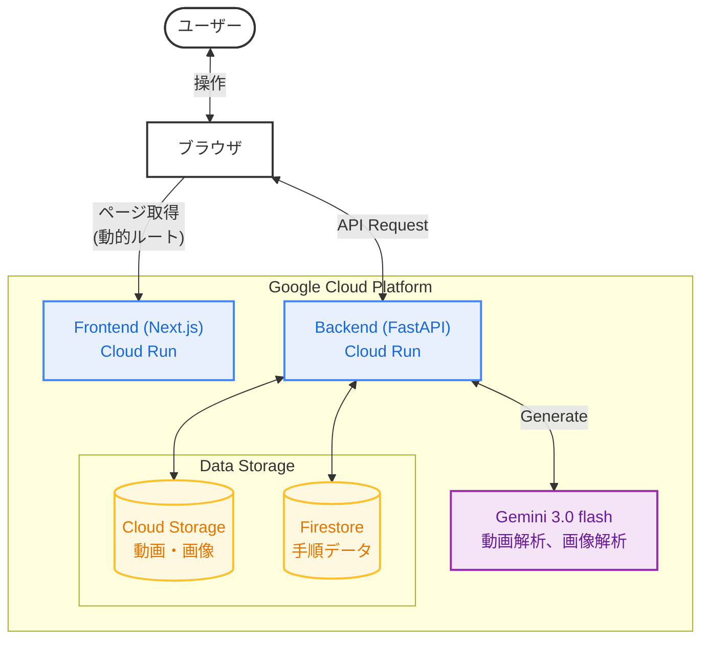
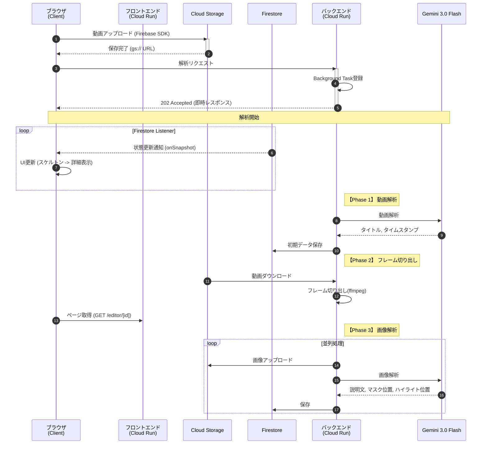

# 基本設計

## MVP機能要件
- 作成者
    - 動画をアップロードする
    - 動画から手順ごとのタイトルを生成する
    - 動画から手順ごとの画像を切り抜く
    - 画像内に手順に対する説明を生成する
    - 画像内の個人情報をマスクする
    - 画像内のボタンを赤枠で強調する
    - AIの出力を手動で変更する
    - 手順書を保存する
    - 編集モードとプレビューモードがある
    - 利用者が指摘した箇所を確認する
    - 利用者に手順書を共有する(URLでの共有)
    - 手順書をPDFでダウンロードする(開発せずに印刷機能を使う)
- 利用者
    - 手順書を閲覧できる
    - 手順書の誤りをコメントで指摘する
    - 他人の指摘の履歴を確認する


## 非MVP機能要件
- 作成者
    - 追加の動画で部分的な差分をとる
    - 入力動画が綺麗ではない時の対応
        - 動画内で間違った手順が含まれてる、手戻りがある、など
    - 手順書と動画のシンクロ
        - テキストや切り出し画像をクリックすると動画がその位置に飛ぶ
        - 動画のシークバーを動かすと手順書の該当箇所に飛ぶ


## 技術スタック
- バックエンド
    - フレームワーク: FastAPI
    - AI: Google GenAI SDK (Gemini 3.0 Flash), Vertex AI
        - 動画などのマルチモーダルに強い
    - 画像処理: ffmpeg
- フロントエンド
    - フレームワーク: Next.js
    - UI: TailwindCSS
    - Canvas: Konva / React Konva
    - 動画アップロード: Firebase SDK
        - サーバを経由せず直接アップロードする
- データベース
    - Firestore
        - テキストやユーザー情報など
        - 動画はCloud StrageのURLとして保存する
    - Cloud Storage
        - 動画と画像(これらはFirestoreだと大きすぎる)
        - GeminiはCloud Strageの動画を解析できる
        - 動画 → フロント → Cloud Storage → Gemini の流れ
- デプロイ 
    - フロントエンド: **Cloud Run（採用）**
        - 理由: Next.jsの動的ルート（`/editor/[id]`など）を使用するため
        - メリット:
            - SSR、動的ルート、API Routesなど、Next.jsの全機能が使用可能
            - バックエンドと統一された環境
            - Dockerfileで環境を完全に制御可能
        - デメリット:
            - デプロイが若干遅い（ビルド時間）
            - コールドスタート時のレイテンシ
        - **検討したが不採用: Firebase Hosting**
            - メリット: デプロイが速い、CDN自動配信
            - デメリット: 静的エクスポート（`output: 'export'`）が必須で、動的ルートに対応できない
    - バックエンド: Cloud Run


## アーキテクチャ図(概要)


```mermaid
graph TD
    %% スタイル定義
    classDef user fill:#fff,stroke:#333,stroke-width:2px;
    classDef compute fill:#e8f0fe,stroke:#4285f4,stroke-width:2px,color:#1967d2;
    classDef storage fill:#fff8e1,stroke:#fbc02d,stroke-width:2px,color:#e37400;
    classDef ai fill:#f3e5f5,stroke:#9c27b0,stroke-width:2px,color:#6a1b9a;

    User([ユーザー])
    Browser[ブラウザ]

    subgraph "Google Cloud Platform"
        direction TB
        
        FE["Frontend (Next.js)"<br/>Cloud Run]
        BE["Backend (FastAPI)"<br/>Cloud Run]
        
        subgraph "Data Storage"
            GCS[(Cloud Storage<br/>動画・画像)]
            DB[(Firestore<br/>手順データ)]
        end
        
        AI[Gemini 3.0 flash<br/>動画解析、画像解析]
    end

    User <-->|操作| Browser
    Browser -- "ページ取得<br/>(動的ルート)" --> FE
    Browser <-->|API Request| BE
    
    BE <--> GCS
    BE <--> DB
    BE <-->|Generate| AI

    %% クラス適用
    class User user;
    class FE,BE compute;
    class GCS,DB storage;
    class AI ai;
    class Browser user;
```


## アーキテクチャ図(詳細フロー)


```mermaid
sequenceDiagram
    autonumber
    participant Browser as ブラウザ<br/>(Client)
    participant FE as フロントエンド<br/>(Cloud Run)
    participant GCS as Cloud Storage
    participant DB as Firestore
    participant API as バックエンド<br/>(Cloud Run)
    participant AI as Gemini 3.0 Flash

    Browser->>GCS: 動画アップロード (Firebase SDK)
    activate GCS
    GCS-->>Browser: 保存完了 (gs:// URL)
    deactivate GCS

    Browser->>API: 解析リクエスト
    activate API
    API->>API: Background Task登録
    API-->>Browser: 202 Accepted (即時レスポンス)
    deactivate API

    Note over Browser, AI: 解析開始
    loop Firestore Listener
        DB-->>Browser: 状態更新通知 (onSnapshot)
        Browser->>Browser: UI更新 (スケルトン -> 詳細表示)
    end

    Note right of API: 【Phase 1】 動画解析
    API->>AI: 動画解析
    AI-->>API: タイトル, タイムスタンプ
    API->>DB: 初期データ保存

    Note right of API: 【Phase 2】 フレーム切り出し
    GCS->>API: 動画ダウンロード
    API->>API: フレーム切り出し(ffmpeg)
    
    Browser->>FE: ページ取得 (GET /editor/[id])

    Note right of API: 【Phase 3】 画像解析
    loop 並列処理
        API->>GCS: 画像アップロード
        API->>AI: 画像解析
        AI-->>API: 説明文, マスク位置, ハイライト位置
        API->>DB: 保存
    end
```


## ページ構成
```
/
├── /login          # ログイン画面
├── /dashboard      # ダッシュボード (一覧表示、フィードバック通知、アップロード)
├── /editor/[id]    # 編集画面
└── /share/[id]     # 手順書閲覧画面
```
