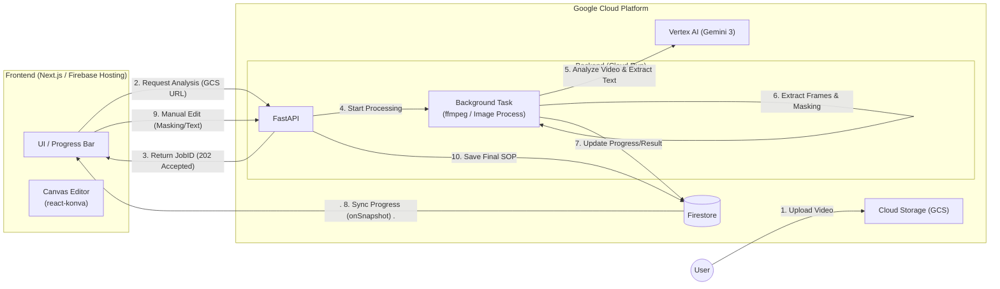

# 基本設計

## MVP機能要件
- 作成者
    - 動画をアップロードする
    - 動画から手順ごとのテキストを生成する
    - 動画から手順ごとの画像を切り抜く
    - 画像内の個人情報をマスクする
    - 画像内のボタンを赤枠で強調する
    - AIの出力を手動で変更する
    - 作成者権限でログインする
    - 編集モードとプレビューモードがある
    - 利用者が指摘した箇所を確認する
    - 利用者に手順書を共有する(URLでの共有)
    - 手順書をPDFでダウンロードする(開発せずに印刷機能を使う)
- 利用者
    - 手順書を閲覧できる(要検討: ログインなしもしくは閲覧権限でのログイン)
    - 手順書の古い箇所を1クリックで指摘する
        - TeamsやSlackのスタンプorYoutubeの低評価ボタンみたいなイメージ
    - 指摘の際にコメントを残す


## 非MVP機能要件
- 作成者
    - 追加の動画で部分的な差分をとる
    - 入力動画が綺麗ではない時の対応
        - 動画内で間違った手順が含まれてる、手戻りがある、など
    - 手順書と動画のシンクロ
        - テキストや切り出し画像をクリックすると動画がその位置に飛ぶ
        - 動画のシークバーを動かすと手順書の該当箇所に飛ぶ
- 利用者
    - 他人の指摘の履歴を確認する
        - 要検討: MVPに入れてもいいかも


## 技術スタック
- バックエンド
    - フレームワーク: FastAPI
    - AI: Vertex AI (Gemini 3)
        - 動画などのマルチモーダルに強い
    - Agentフレームワーク: ADK
    - 画像処理: ffmpeg
- フロントエンド
    - フレームワーク: Next.js
    - UI: TailwindCSS
    - Canvas: react-konva
    - 動画アップロード: Firebase SDK
        - サーバを経由せず直接アップロードする
- データベース
    - Firestore
        - テキストやユーザー情報など
        - 動画はCloud StrageのURLとして保存する
    - Cloud Storage
        - 動画と画像(これらはFirestoreだと大きすぎる)
        - GeminiはCloud Strageの動画を解析できる
        - 動画 → フロント → Cloud Storage → Gemini の流れ
- デプロイ 
    - フロントエンド: Cloud Run もしくは Firebase Hosting
        - Cloud Run: 
            - 統一感ある
            - Dockerfile書くのは問題ない
            - デブロイが遅い
        - Firebase Hosting: 
            - デプロイが速い
            - 裏でCloud Runを使ってる
            - デメリットはあまりない
    - バックエンド: Cloud Run


## アーキテクチャ図(MVP)


## アーキテクチャ図(非MVP)




## ページ構成
```
/
├── /login          # ログイン画面
├── /dashboard      # ダッシュボード (一覧表示、フィードバック通知、アップロード)
├── /editor/[id]    # 編集画面
└── /share/[id]     # 手順書閲覧画面
```
